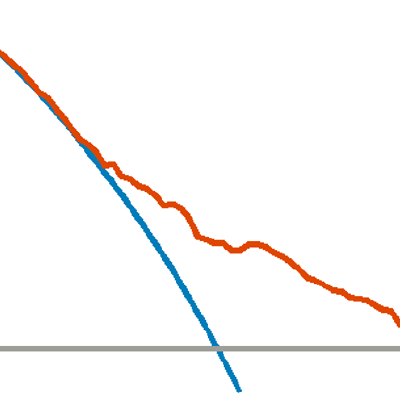
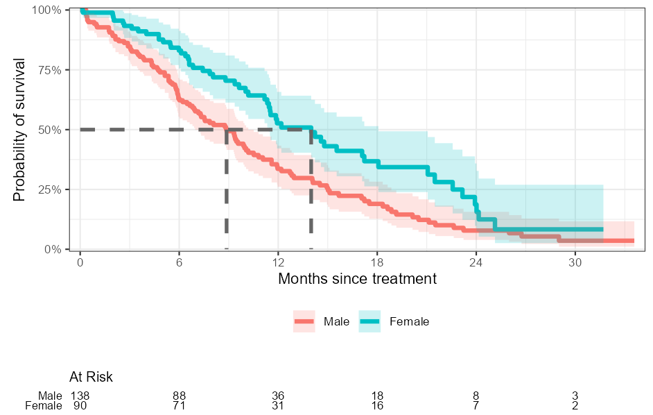
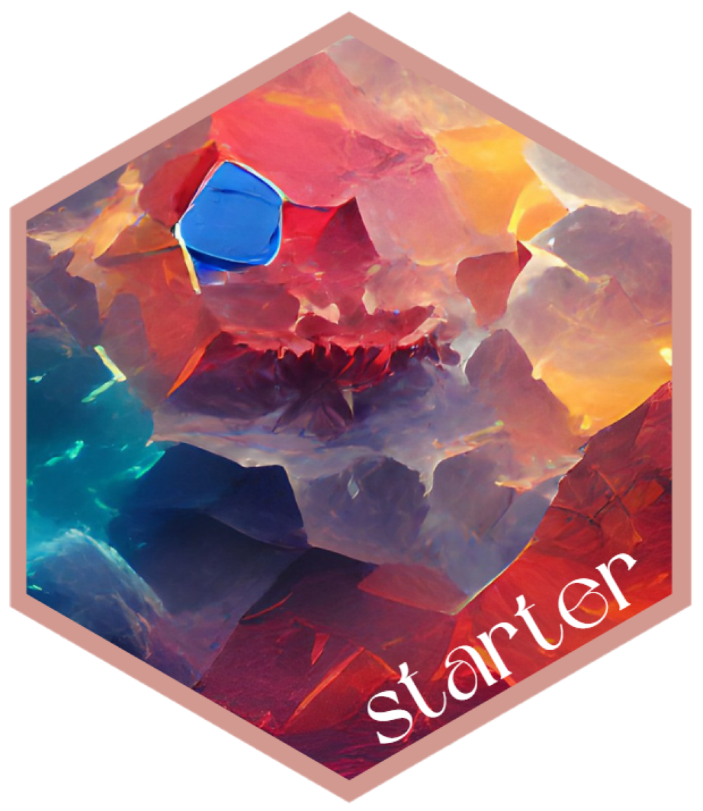
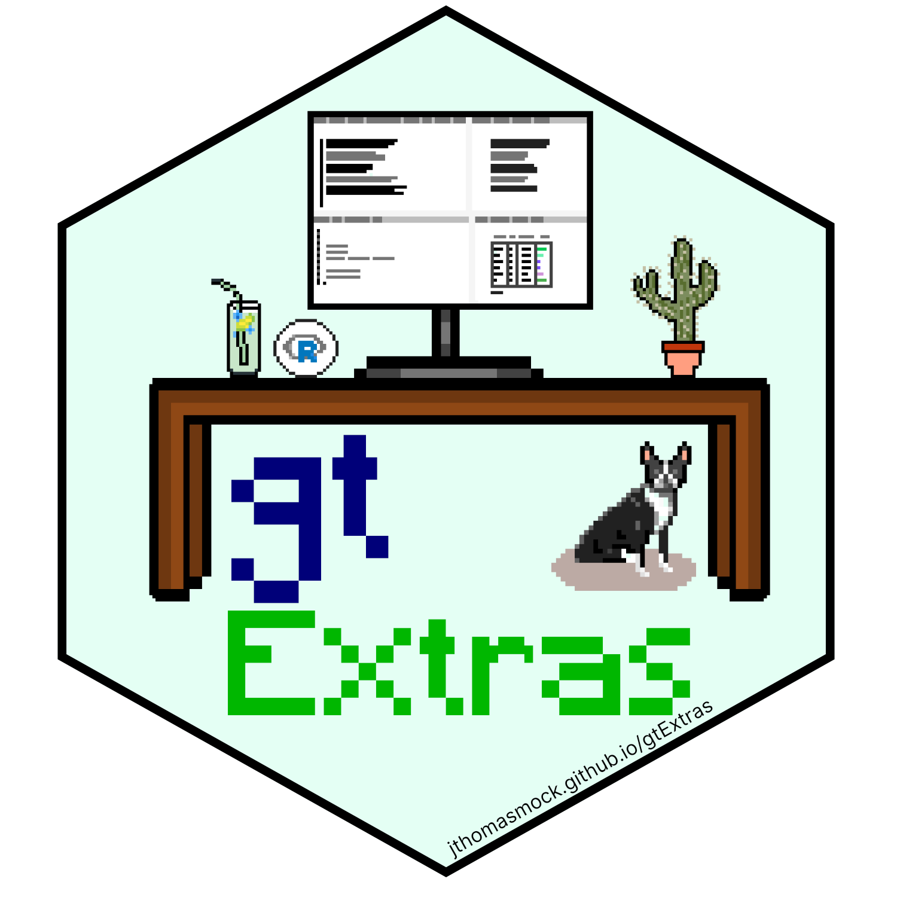

## gtsummary

:::float-image
<a href="http://www.danieldsjoberg.com/gtsummary/">
```{r out.width='175px', out.extra='style="float:right; padding:1px"', echo=FALSE}
knitr::include_graphics("https://raw.githubusercontent.com/ddsjoberg/gtsummary/master/man/figures/logo.png")
```
</a>
Language **R**

The {gtsummary} package provides an elegant and flexible way to create publication-ready analytic and summary tables using the **R** programming language. 
The {gtsummary} package summarizes data sets, regression models, and more, using sensible defaults with highly customizable capabilities.
By leveraging [{broom}](https://broom.tidymodels.org/), [{gt}](https://gt.rstudio.com/), and [{labelled}](http://larmarange.github.io/labelled/) packages, {gtsummary} creates beautifully formatted, ready-to-share summary and result tables in a single line of R code!  

:::

  - [**Summarize data frames or
    tibbles**](http://www.danieldsjoberg.com/gtsummary/articles/tbl_summary.html)
    easily in **R**. Perfect for presenting descriptive statistics,
    comparing group **demographics** (e.g creating a **Table 1** for
    medical journals), and more. Automatically detects continuous,
    categorical, and dichotomous variables in your data set, calculates
    appropriate descriptive statistics, and also includes amount of
    missingness in each variable.

  - [**Summarize regression
    models**](http://www.danieldsjoberg.com/gtsummary/articles/tbl_regression.html)
    in R and include reference rows for categorical variables. Common
    regression models, such as logistic regression and Cox proportional
    hazards regression, are automatically identified and the tables are
    pre-filled with appropriate column headers (i.e. Odds Ratio and
    Hazard Ratio).

  - [**Customize gtsummary
    tables**](http://www.danieldsjoberg.com/gtsummary/reference/index.html#section-general-formatting-styling-functions)
    using a growing list of formatting/styling functions.
    **[Bold](http://www.danieldsjoberg.com/gtsummary/reference/bold_italicize_labels_levels.html)**
    labels,
    **[italicize](http://www.danieldsjoberg.com/gtsummary/reference/bold_italicize_labels_levels.html)**
    levels, **[add
    p-value](http://www.danieldsjoberg.com/gtsummary/reference/add_p.html)**
    to summary tables,
    **[style](http://www.danieldsjoberg.com/gtsummary/reference/style_percent.html)**
    the statistics however you choose,
    **[merge](http://www.danieldsjoberg.com/gtsummary/reference/tbl_merge.html)**
    or
    **[stack](http://www.danieldsjoberg.com/gtsummary/reference/tbl_stack.html)**
    tables to present results side by side… there are so many
    possibilities to create the table of your dreams\!

  - **[Report statistics
    inline](http://www.danieldsjoberg.com/gtsummary/articles/tbl_summary.html#inline_text)**
    from summary tables and regression summary tables in **R markdown**.
    Make your reports completely reproducible\!

Installation Code: `install.packages("gtsummary")`

More information at http://www.danieldsjoberg.com/gtsummary/

----

## Decision Curve Analysis

:::float-image
<a href="https://www.danieldsjoberg.com/dca-tutorial/dca-tutorial-r.html">
```{r out.width='175px', out.extra='style="float:right; padding:1px"', echo=FALSE}

```
</a>
Languages **R**, **Stata**, **SAS**

Decision-analytic techniques allow assessment of clinical outcomes but often require collection of additional information may be cumbersome to apply to models that yield a continuous result.
Decision curve analysis is a method for evaluating and comparing prediction models that incorporates clinical consequences, requires only the data set on which the models are tested, and can be applied to models that have either continuous or dichotomous results.

Detailed **tutorial** and **installation instructions** at https://www.danieldsjoberg.com/dca-tutorial/dca-tutorial-r.html

R package website: http://www.danieldsjoberg.com/dcurves/

:::

Vickers AJ, Elkin EB. "Decision curve analysis: a novel method for evaluating prediction models." _Medical Decision Making._ 2006 Nov-Dec;26(6):565-74.

Vickers AJ, Cronin AM, Elkin EB, Gonen M. "Extensions to decision curve analysis, a novel method for evaluating diagnostic tests, prediction models and molecular markers." _BMC Medical Informatics and Decision Making._ 2008 Nov 26;8(1):53. 

----

## ggsurvfit

:::float-image
<a href="http://www.danieldsjoberg.com/ggsurvfit/">
```{r out.width='300px', out.extra='style="float:right; padding:1px"', echo=FALSE}

```
</a>
Language **R**

The {ggsurvfit} package eases the creation of time-to-event (aka survival) endpoint figures with ggplot.
The concise and modular code creates images that are ready for publication or sharing.
Each of the functions that add to or modify the existing ggplot are written as proper ggplot geoms or stat methods, allowing the functions from this package to be combined with any functions or customization from ggplot and other ggplot extensions.

:::

Installation Code: `install.packages("ggsurvfit")`

More information at http://www.danieldsjoberg.com/ggsurvfit/

----

## starter

:::float-image
<a href="http://www.danieldsjoberg.com/starter/">
```{r out.width='175px', out.extra='style="float:right; padding:1px"', echo=FALSE}

```
</a>
Language **R**

Get started with new projects by dropping a skeleton of a new project into a new or existing directory, initialise git repositories, and create reproducible environments with the 'renv' package.
The package allows for dynamically named files, folders, file content, as well as the functionality to drop individual template files into existing projects.

:::

Installation Code: `install.packages("starter")`

More information at http://www.danieldsjoberg.com/starter/

----

## rstudio.prefs

:::float-image
<a href="http://www.danieldsjoberg.com/rstudio.prefs/">
```{r out.width='175px', out.extra='style="float:right; padding:1px"', echo=FALSE}
knitr::include_graphics("images/rstudio_logo.png")
```
</a>
Language **R**

As of RStudio v1.3, the preferences in the Global Options dialog (and a number of other preferences that aren’t) are now saved in simple, plain-text JSON files.
This package provides an interface for working with these RStudio JSON preference files to easily make modifications without using the point-and-click option menus.
This is particularly helpful when working on teams to ensure a unified experience across machines and utilizing settings for best practices.

:::

Installation Code: `install.packages("rstudio.prefs")`

More information at http://www.danieldsjoberg.com/rstudio.prefs/

----

## gtreg

:::float-image
<a href="https://shannonpileggi.github.io/gtreg/">
```{r out.width='175px', out.extra='style="float:right; padding:1px"', echo=FALSE}
knitr::include_graphics("images/gtreg.png")
```
</a>
Language **R**

The {gtreg} package creates tabular data summaries appropriate for regulatory submissions.
The package builds the tables using {gtsummary}.

:::

Installation Code: `install.packages("gtreg")`

More information at https://shannonpileggi.github.io/gtreg/

----

## broom.helpers

:::float-image
<a href="https://larmarange.github.io/broom.helpers/">
```{r out.width='175px', out.extra='style="float:right; padding:1px"', echo=FALSE}

```
</a>
Language **R**

The {broom.helpers} package provides suite of functions to work with regression model `broom::tidy()` tibbles.
The suite includes functions to group regression model terms by variable, insert reference and header rows for categorical variables, add variable labels, and more.
{broom.helpers} is used, in particular, by `gtsummary::tbl_regression()` for producing nice formatted tables of model coefficients and by `GGally::ggcoef_model()` for plotting model coefficients.

:::

Installation Code: `install.packages("broom.helpers")`

More information at https://larmarange.github.io/broom.helpers/

----

## visR

:::float-image
<a href="https://openpharma.github.io/visR/">
```{r out.width='175px', out.extra='style="float:right; padding:1px"', echo=FALSE}

```
</a>
Language **R**

Enables fit-for-purpose, reusable clinical and medical research focused visualizations and tables with sensible defaults and based on sound graphical principles.

:::

Installation Code: `install.packages("visR")`

More information at https://openpharma.github.io/visR/

## tidycmprsk

Language **R**

The {tidycmprsk} package provides an intuitive interface for working with the competing risk endpoints.
The package wraps the {cmprsk} package, and exports functions for univariate cumulative incidence estimates with `cuminc()` and competing risk regression with `crr()`.
The package also includes broom-style tidiers: `tidy()`, `augment()`, and `glance()`.

Installation Code: `install.packages("tidycmprsk")`

More information at https://mskcc-epi-bio.github.io/tidycmprsk/

----

## bstfun

Language **R**

A miscellaneous collection of functions to used by members of the Biostatistics Department at MSKCC.
Functions in the {bstfun} package do not fall within the well-defined packages with more narrow scope used by the department.

Installation Code: `devtools::install_github("ddsjoberg/bstfun")`

More information at http://www.danieldsjoberg.com/bstfun/

----

# Contributions

## gtExtras

:::float-image
<a href="https://jthomasmock.github.io/gtExtras/">
```{r out.width='175px', out.extra='style="float:right; padding:1px"', echo=FALSE}

```
</a>
Language **R**

The goal of {gtExtras} is to provide some additional helper functions to assist in creating beautiful tables with {gt.}
The functions are generally wrappers around boilerplate or adding capabilities that are currently not yet built into {gt}. The {gt} package is amazing, make sure to go read the official documentation.

:::

Installation Code: `remotes::install_github("jthomasmock/gtExtras")`

More information at https://jthomasmock.github.io/gtExtras/

----

## broom

:::float-image
<a href="https://broom.tidymodels.org/">
```{r out.width='175px', out.extra='style="float:right; padding:1px"', echo=FALSE}
knitr::include_graphics("images/broom_logo.png")
```
</a>
Language **R**

The {broom} package summarizes key information about models in tidy tibbles. 
{broom} provides three verbs to make it convenient to interact with model objects: `tidy()`, `glance()`, and `augment()`.

:::

Installation Code: `install.packages("broom")`

More information at https://broom.tidymodels.org/
